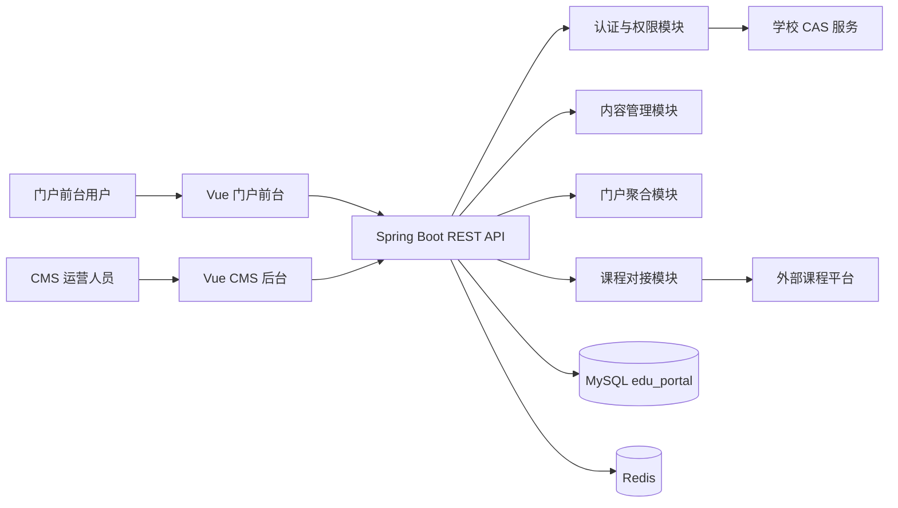

# 教育门户系统架构说明

## 1. 架构目标

教育门户系统面向校内师生、校外访客、内容运营人员和系统管理员，提供统一门户前台、CMS 后台、用户认证与资料管理、课程平台信息聚合能力。系统采用前后端分离架构，前端基于 Vue 3 + Element Plus，后端基于 Spring Boot + MyBatis Plus，数据持久化使用 MySQL，缓存、会话与轻量级限流使用 Redis。

核心目标：

- 统一门户入口：承载新闻公告、栏目导航、专题内容、课程入口和公共服务入口。
- 内容可运营：CMS 支持栏目、文章、附件、发布状态、审核流和内容版本管理。
- 身份统一：校内用户通过 CAS 单点登录，校外用户通过注册、审核、密码登录或短信/邮箱校验进入系统。
- 课程联动：与课程平台进行用户身份映射、课程目录同步、选课/学习链接跳转和同步任务审计。
- 可演进：模块边界清晰，接口版本化，数据库使用软删除、审计字段和可扩展 JSON 字段。

## 2. 总体架构

系统分层：

- 表现层：门户前台和 CMS 后台共享 API 基础能力，按路由和权限区分功能。
- API 层：提供 RESTful 接口、参数校验、统一响应、异常处理、鉴权拦截和审计日志。
- 领域服务层：封装用户、权限、内容、课程同步、门户聚合等业务规则。
- 数据访问层：基于 MyBatis Plus 管理实体、Mapper、分页查询和事务。
- 集成层：对 CAS、课程平台、邮件/短信、文件存储等外部系统做适配，避免外部协议泄漏到业务层。

## 3. 模块划分

### 3.1 门户前台模块

职责：

- 首页聚合：轮播图、快捷入口、新闻公告、专题位、热门课程。
- 栏目浏览：按栏目树展示文章列表、详情、附件和相关推荐。
- 搜索：按关键词、栏目、发布时间、标签检索已发布内容。
- 课程入口：展示从课程平台同步的课程目录，支持按学期、学院、分类筛选。
- 个人中心：展示基础资料、绑定状态、学习入口和消息通知。

关键服务：

- `PortalAggregationService`：首页、栏目页、专题页聚合数据。
- `PublishedContentService`：只读取已发布、未删除、在有效期内的内容。
- `CourseCatalogFacade`：课程列表、课程详情、外部学习链接组装。

### 3.2 CMS 后台模块

职责：

- 栏目管理：栏目树、排序、启停、访问路径和展示模板。
- 内容管理：文章草稿、提交审核、发布、下线、置顶、推荐、标签和附件。
- 媒体资源：图片、文档、视频等附件元数据管理。
- 审核流：支持编辑提交、审核通过、驳回、发布和下线审计。
- 运营配置：轮播图、友情链接、快捷入口、首页模块配置。

关键服务：

- `CategoryService`：维护栏目层级和路径唯一性。
- `ArticleWorkflowService`：管理文章状态流转。
- `MediaAssetService`：管理附件元数据和业务引用关系。
- `AuditLogService`：记录后台关键操作。

### 3.3 用户系统模块

职责：

- 校内登录：通过 CAS 登录票据换取校内身份，建立本系统会话。
- 校外注册：支持邮箱/手机号注册、资料补充、审核和账号启停。
- 权限控制：RBAC 角色权限模型，支持门户用户、编辑、审核员、管理员等角色。
- 身份绑定：维护本地用户与 CAS 用户、课程平台账号之间的映射。
- 会话管理：Token、刷新、注销、登录失败保护和权限缓存。

身份来源：

- `CAS`：校内师生、教职工等可信身份来源。
- `LOCAL`：校外注册用户或运维创建用户。
- `LMS`：课程平台身份映射，不作为主登录源，仅用于跳转与数据同步。

### 3.4 课程平台对接模块

职责：

- 同步课程目录：课程、教师、学期、分类、状态和学习链接。
- 同步用户映射：根据学号/工号/邮箱/手机号建立本地用户与课程平台账号关系。
- 跳转课程平台：生成外部课程平台访问 URL，必要时携带签名、时间戳或一次性 token。
- 同步审计：记录每次同步批次、状态、耗时、错误详情和处理数量。

集成方式建议：

- 优先使用课程平台 REST API，定时拉取课程目录和增量更新。
- 对不支持实时 API 的平台，保留文件导入或消息队列适配点。
- 外部协议封装在 `CoursePlatformClient`，业务层只依赖内部 DTO。

## 4. 数据架构

数据库使用 MySQL 8.x，字符集 `utf8mb4`，排序规则 `utf8mb4_unicode_ci`。所有业务表默认包含：

- `id`：BIGINT 主键。
- `created_at` / `updated_at`：创建和更新时间。
- `created_by` / `updated_by`：操作人。
- `deleted`：软删除标记。

核心数据域：

- 用户权限域：`sys_user`、`sys_role`、`sys_permission`、`sys_user_role`、`sys_role_permission`、`external_identity`。
- 内容域：`cms_category`、`cms_article`、`cms_article_version`、`cms_media_asset`、`cms_article_asset`、`cms_audit_log`。
- 门户配置域：`portal_banner`、`portal_quick_link`、`portal_site_config`。
- 课程域：`course_term`、`course_catalog`、`course_user_mapping`、`course_sync_job`。

## 5. 权限与安全

- 前台公开接口只返回发布态内容，不暴露草稿、审核中、已下线和软删除数据。
- 后台接口必须登录并具备对应权限码，例如 `cms:article:create`、`cms:article:publish`。
- CAS 登录使用票据校验，后端只信任 CAS 服务端校验结果，不信任前端传入的身份字段。
- 校外注册用户默认进入 `PENDING_REVIEW` 状态，经后台审核后方可访问受限资源。
- Token 建议使用短期 Access Token + Refresh Token；后台关键操作写入审计日志。
- 课程平台跳转链接必须设置过期时间，签名密钥由后端安全配置管理。

## 6. 缓存与性能

- Redis 缓存栏目树、首页配置、权限列表、热点文章和 CAS 登录临时态。
- CMS 内容发布或下线后，按栏目、首页模块和文章 ID 精准失效缓存。
- 列表接口统一分页，默认 `page=1`、`size=20`，最大 `size=100`。
- 搜索可先基于 MySQL 索引和 FULLTEXT，后续按规模演进到 Elasticsearch/OpenSearch。

## 7. 部署视图

本地和测试环境可使用 `docker-compose.yml` 启动 MySQL 与 Redis。推荐生产部署：

- 前端静态资源部署到 Nginx 或对象存储 + CDN。
- 后端服务至少双实例部署，通过网关或负载均衡暴露 `/api`。
- MySQL 使用主从或高可用托管实例，开启定期备份。
- Redis 使用独立实例或托管服务，缓存数据可丢失，会话数据需设置合理 TTL。
- 外部 CAS 与课程平台设置网络白名单、超时、重试和熔断策略。

## 8. 审计与可观测性

- 所有后台写操作记录 `cms_audit_log`，包含操作者、动作、目标类型、目标 ID、请求 IP 和变更摘要。
- 课程同步任务记录 `course_sync_job`，失败时保留错误消息和原始响应摘要。
- 后端输出结构化日志，包含 `traceId`、用户 ID、接口路径、耗时和错误码。
- 核心指标：登录成功率、CAS 校验耗时、内容发布量、首页接口耗时、课程同步成功率。

## 9. 演进边界

- 多校区/多站点：通过 `portal_site_config` 和栏目 `site_code` 扩展。
- 多语言：内容表增加语言字段或拆分内容本地化表。
- 工作流增强：当前审核状态字段可升级为独立流程实例表。
- 文件存储：当前只保存资源元数据，实际二进制文件可接本地存储、MinIO 或对象存储。
